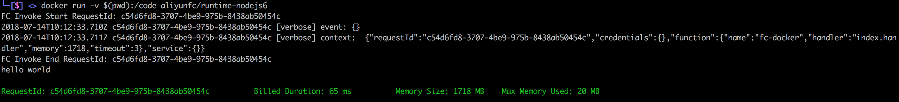

## fc-docker

[](https://travis-ci.org/aliyun/fc-docker)

fc docker 是对线上函数运行环境的完全模拟，并且能够让您在本地编译、运行函数。



您能够通过 fc-docker 在本地机器开发测试您的函数，并且该函数的运行结果会与线上结果一致。

目前已经获得支持的 fc runtime 有：nodejs6、nodejs8、nodejs10、python2.7、python3.6、java8、php7.2。

除了可以运行您的函数，本项目还包含 runtime 对应的用于编译项目的镜像。他们包含了常用的编译工具打包工具，比如 gcc、g++、npm、maven 等。

注意：[Fun](https://github.com/aliyun/fun) 现已基于 fc-docker，推出了 fun local 子命令，用于本地运行、调试函数。体验更好，推荐优先使用 Fun。

## 使用条件

要使用本项目，需要首先安装 [docker](https://www.docker.com/)。

## 示例

您可以在 demos 目录体验：

```shell
# 进入 demos/nodejs6 或者 demos/nodejs8 目录，执行下面命令分别在 nodejs6 和 nodejs8 中运行函数：

docker run --rm -v $(pwd):/code aliyunfc/runtime-nodejs6 --handler "index.handler" --event '{"some": "event"}'

# 进入 demos/python2.7 目录，执行下面命令在 python2.7 中运行函数：
docker run --rm -v $(pwd):/code aliyunfc/runtime-python2.7 --handler "index.handler" --event '{"some": "event"}'

# 进入 demos/python3.6 目录，执行下面命令在 python3.6 中运行函数：
docker run --rm -v $(pwd):/code aliyunfc/runtime-python3.6 --handler "index.handler" --event '{"some": "event"}'

# 进入 demos/php7.2 目录，执行下面命令在 php7.2 中运行函数：
docker run --rm -v $(pwd):/code aliyunfc/runtime-php7.2 --handler "index.handler" --event '{"some": "event"}'

# 进入 demos/java8 目录，执行 mvn package 打包函数，然后执行下面命令运行函数:
docker run -v $(pwd)/target/java8-1.0.0.jar:/code/java8-1.0.0.jar aliyunfc/runtime-java8 --handler "examples.Hello::handleRequest"

```

支持更多的长/短参数，列表如下：

| 短参数  | 长参数  | 参数含义 |
| :---------- |:---------------:| -----:|
| -h     |--handler| 函数入口 |
|   无    | --timeout        |    函数超时时间 |
| -i |--initializer        |    函数初始化入口 |
| -e |--initializationTimeout        |    初始化超时时间 |
| 无 |    --event    |    上传event |
| 无 |    --stdin    |  event 从 stdin 中获取 | 
| 无 |    --server   |  server 模式 |

build 镜像的使用方法：

```shell
# 下载 nodejs 依赖(npm rebuild)
docker run --rm -v $(pwd):/code aliyunfc/runtime-nodejs6:build

# 在 build 容器中运行自定义命令
docker run --rm -v $(pwd):/code aliyunfc/runtime-python2.7:build fun 
docker run --rm -v $(pwd):/code aliyunfc/runtime-python3.6:build fcli

# 在 build 容器中运行交互式 bash
docker run --rm -it -v $(pwd):/code aliyunfc/runtime-python2.7:build bash
```

## 环境变量

本项目支持通过环境变量定制容器的一些行为，可用的环境变量包括：

- FC_ACCESS_KEY_ID
- FC_ACCESS_KEY_SECRET
- FC_SECURITY_TOKEN
- FC_FUNCTION_NAME

使用方法为：

```shell
docker run --rm -it -e FC_ACCESS_KEY_ID=xxxxxxx -e FC_ACCESS_KEY_SECRET=xxxxxxxx -v $(pwd):/code nodejs6
```

## build 环境中包含的依赖

- fcli
- fun
- vim 
- zip
- git
- build-essential
- clang
- libgmp3-dev
- python2.7-dev
- apt-utils
- dialog